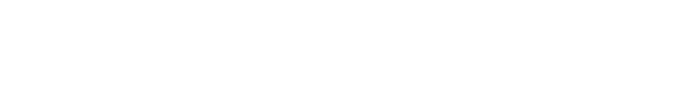

<!--
Hey, thanks for using the awesome-readme-template template.
If you have any enhancements, then fork this project and create a pull request
or just open an issue with the label "enhancement".

Don't forget to give this project a star for additional support ;)
Maybe you can mention me or this repo in the acknowledgements too
-->
<div align="center">

    
  <p>
    A psycological 3D game built in <a href="https://www.raylib.com/">Raylib</a>
  </p>
  
  <p>
  <a href="https://www.raylib.com/">
    
  </a>
  <a href="https://gcc.gnu.org/">
    
  </a>
   <a href="https://www.debian.org/">
    
  </a>
  <a href="https://ubuntu.com">
    
  </a>   
</div>
<br />

<!-- Table of Contents -->

# :notebook_with_decorative_cover: Table of Contents

- [About the Project](#star2-about-the-project)
  - [Screenshots](#camera-screenshots)
  - [Features](#dart-features)
- [Getting Started](#toolbox-getting-started)
  - [Prerequisites](#bangbang-prerequisites)
  - [Build Instructions](#running-build-instructions)
- [Roadmap](#compass-roadmap)
- [Contributing](#wave-contributing)


## :star2: About the Project

<!-- Screenshots -->

### :camera: Screenshots

<div align="center"> 
  
  
  
</div>

### :dart: Features

- [x] Dense Procedural Grass Generation
- [x] Night skybox
- [x] Rainy weather
- [x] Ambient Fireflies
- [x] Cutscene

## :toolbox: Getting Started

<!-- Prerequisites -->
### :bangbang: Prerequisites

- This project uses **GCC** and **raylib**
Refer <a href="https://github.com/raysan5/raylib/wiki/Working-on-GNU-Linux"> this</a> to install raylib
- <a href="https://ftp.gnu.org/gnu/make/"> make </a>


<!-- Installation -->

### :running: Build Instructions

Clone the project

```bash
  git clone https://github.com/sceptix-club/Nocturne.git
```

Go to the project directory

```bash
  cd Nocturne
```
Build

```bash
  make clean && make
```
Run
```
./game
```
## :compass: Roadmap

- [x] Dense Procedural Grass Generation
- [x] Night Skybox
- [x] Rainy Weather
- [x] Ambient Fireflies
- [x] Infinite Terrain Generation
- [x] Dialogue System
- [x] Cutscenes
- [x] Dynamic Object Loading
- [x] Procedural Tree Generation
- [ ] Fog Effects for Depth and Atmosphere
- [ ] A terrain marker system
- [ ] Build on Windows and OS X

---

## :wave: Contributing

This game is open for contributions! Whether you'd like to add new features, fix bugs, improve performance, or enhance existing elements, your help is welcome. Feel free to fork the repository, make your changes, and create a pull request. Let's build something amazing together!
